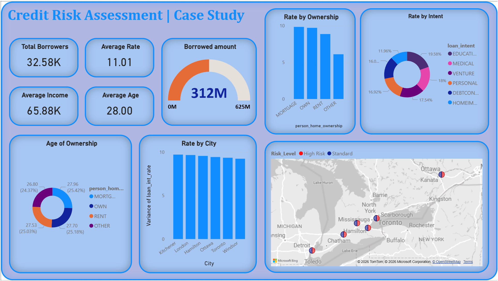
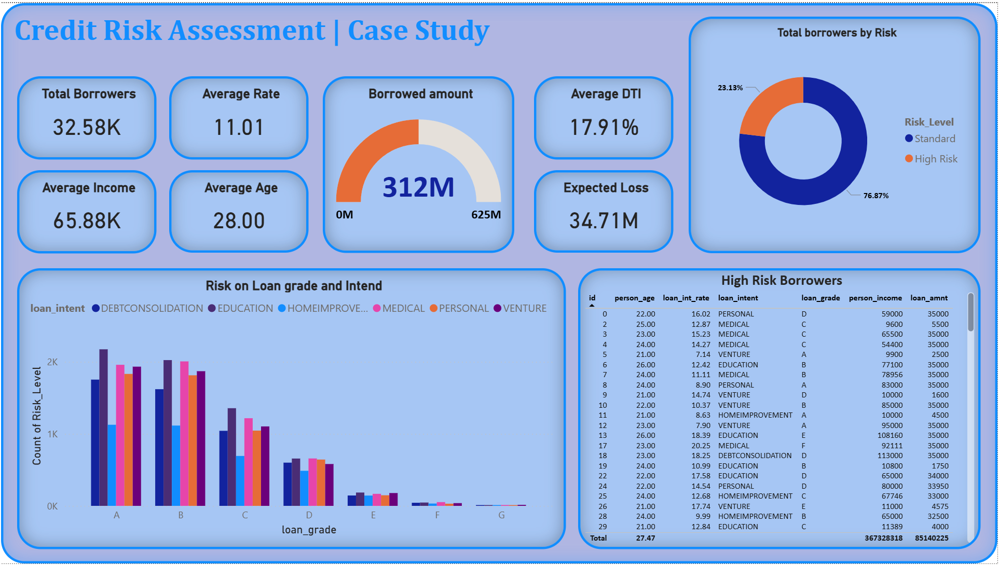

# 🇨🇦 Autonomous Credit Risk & Macro-Stress Testing Pipeline
**An End-to-End Data Engineering & Financial Analytics Suite**

[](https://www.python.org/)
[](https://www.microsoft.com/en-us/sql-server/)
[](https://powerbi.microsoft.com/)

## 📌 Executive Summary
This repository features an autonomous **Credit Risk Intelligence System** simulating a Canadian retail banking environment. The pipeline automates the ingestion of 32,000+ records via Python, executing a **500bps interest rate stress test** to calculate borrower resilience. Data is dynamically modeled into a Star Schema and injected into a local SQL Server for executive-level visualization in Power BI.



---

## 🏗️ System Architecture
The system is built as a single-stream automation engine, moving data from raw sources to a structured analytics warehouse.

### 1. The ETL Engine (Python & SQLAlchemy)
The `/script/credit_assesment.py` script serves as the central nervous system:
* **Extraction:** Streamlined ingestion of the [Kaggle Credit Risk Dataset](https://www.kaggle.com/datasets/laotse/credit-risk-dataset).
* **Transformation:** * Implements **Median Imputation** for missing interest rates and employment history.
    * Calculates **Stressed Debt-to-Income (DTI)** by applying a 5% macro-economic buffer.
    * Generates regional geographic markers for Ontario-based spatial analysis.
* **Loading:** Utilizes `SQLAlchemy` for automated SQL injection, generating and populating a relational Star Schema in MS SQL Server.

### 2. Data Warehousing (Star Schema)
The pipeline automatically structures the database into two distinct tables:
* **Fact_Credit_Risk:** Individualized loan performance data, credit history, and stress-test results.
* **Dim_Locations:** Regional dimension table containing latitude/longitude coordinates for Ontario municipalities.


---

## 📊 Analytics & BI Features
The **Credit Risk Assesment.pbix** dashboard provides a "Command Center" view of portfolio health.

* **Geographic Risk Heatmap:** Dynamic bubble mapping of risk concentration in the Windsor-Toronto corridor.
* **Financial KPIs:** DAX-driven measures for **Expected Loss (EL)** and **Capital at Risk**.
* **Demographic Slicing:** Interactive analysis of risk by age group, loan intent, and home ownership status.



---

## 📂 Repository Structure

* **/script/credit_assesment.py**: ETL script for data generation and SQL injection.
* **/images/**: High-resolution images of the dashboard.
* **/csv/**: Local data storage (Ignored via .gitignore).
* **Credit Risk Assesment.pbix**: The master Power BI dashboard file.

---

## 🛠️ Installation & Deployment

### Prerequisites
* Python 3.11+
* MS SQL Server (Express/Developer)
* Power BI Desktop

### Setup
1. **Clone the Repository:**
   ```bash
   git clone [https://github.com/Royster393/Credit-Risk-Analytics-Pipeline.git](https://github.com/Royster393/Credit-Risk-Analytics-Pipeline.git)

2. **Install Dependencies:**
   ```bash
   pip install pandas numpy sqlalchemy pyodbc

3. **Execute Pipeline:**  
   Update the `SERVER_NAME` and `LOCAL_FILE` path in `script/credit_assesment.py`, then run:
   ```bash
   python script/credit_assesment.py
